# Morse Trainer

Practise and decode morse code with Arduino!

_Note, this project is still underway, join in on the development by making it and submitting changes to github!_

Listen to secret coded messages on the short-wave radio with this real time Morse code to text translator! This project uses a 567 Tone Decoder IC to filter out unwanted audio and feeds a clear signal to the Arduino for real time decoding on the ([XC3728](https://jaycar.com.au/p/XC3728)) OLED screen. This project comes in two parts, with the filter on a separate PCB and the Arduino shield containing a buzzer and a push button for Morse sending practice. Of course, you could always attach your own key!

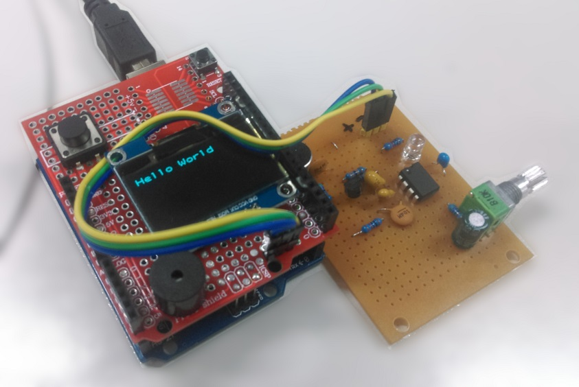

## Table of Contents

- [Morse Trainer](#Morse-Trainer)
  - [Table of Contents](#Table-of-Contents)
  - [Bill of Materials](#Bill-of-Materials)
  - [System overview](#System-overview)
    - [Microphone pre-amp](#Microphone-pre-amp)
    - [Tone Decoder IC](#Tone-Decoder-IC)
  - [Building the boards](#Building-the-boards)
    - [Tone decoder PCB board](#Tone-decoder-PCB-board)
    - [UNO prototyping shield](#UNO-prototyping-shield)
  - [Programming source code](#Programming-source-code)
  - [Use](#Use)
    - [Tuning the decoder](#Tuning-the-decoder)
    - [Serial mode](#Serial-mode)
  - [Further reading](#Further-reading)
    - [Where to Find Morse Code:](#Where-to-Find-Morse-Code)

## Bill of Materials

| Qty | Code                                     | Description                     |
| --- | ---------------------------------------- | ------------------------------- |
| 1   | [XC4410](https://jaycar.com.au/p/XC4410) | Uno Board                       |
| 1   | [XC3728](https://jaycar.com.au/p/XC3728) | OLED Display                    |
| 1   | [ZL3567](https://jaycar.com.au/p/ZL3567) | 567 Tone Decoder IC             |
| 1   | [HP9556](https://jaycar.com.au/p/HP9556) | PCB board (Mini Experimenter's) |
| 1   | [ZT2154](https://jaycar.com.au/p/ZT2154) | 548 Transistor                  |
| 1   | [AM4011](https://jaycar.com.au/p/AM4011) | 2 PIn MIC                       |
| 1   | [ZD0172](https://jaycar.com.au/p/ZD0172) | Green LED                       |
| 1   | [XC4482](https://jaycar.com.au/p/XC4482) | Prototyping shield              |
| 1   | [AB3459](https://jaycar.com.au/p/AB3459) | Piezo Buzzer                    |
| 1   | [SP0609](https://jaycar.com.au/p/SP0609) | PCB Tactile Switch              |
| 1   | [HM3211](https://jaycar.com.au/p/HM3211) | Vertical 28 way header          |
| 1   | [WC6026](https://jaycar.com.au/p/WC6026) | Socket socket leads             |
| 1   | [RP8510](https://jaycar.com.au/p/RP8510) | 10K Potentiometer               |
| 1   | [RR0644](https://jaycar.com.au/p/RR0644) | 1M resistors                    |
| 1   | [RR0632](https://jaycar.com.au/p/RR0632) | 330k resistors                  |
| 1   | [RR0588](https://jaycar.com.au/p/RR0588) | 4.7k resistors                  |
| 1   | [RR0596](https://jaycar.com.au/p/RR0596) | 10k resistors                   |
| 1   | [RC5494](https://jaycar.com.au/p/RC5494) | 220nF blue monocap              |
| 1   | [RC5360](https://jaycar.com.au/p/RC5360) | 100nF ceramic cap (pack of 2)   |
| 1   | [RZ6627](https://jaycar.com.au/p/RZ6627) | 1uF tantalum cap                |
| 1   | [RZ6632](https://jaycar.com.au/p/RZ6632) | 2.2uF tantalum cap              |

## System overview

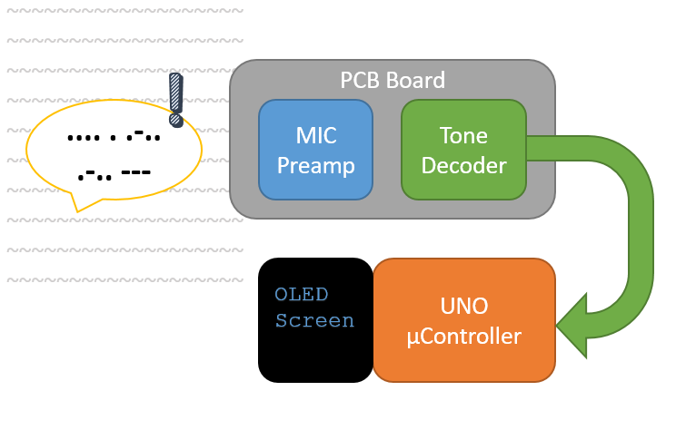

The basic idea to this project is pretty simple, we will create a PCB board that can pick up a filtered _tone_ and send that to the arduino to be processed and translated from morse code into text, and put that on to the OLED screen. The will also just have a buzzer and a button on it so we can reply back in morse code, and through this we can also attach the serial monitor, so that we can do audio communications through the serial terminal.

The meat of this project, funnily enough, is on that PCB board. We are using the `567 Tone Decoder` IC so that we can _selectively_ filter out background noise. The tone decoder will only output a value when it hears the correct _frequency_ though it's input pin, which is fed through by a Microphone and pre-amp.

Most morse transmissions (through audio) is heard at about a 400Hz - 700Hz tone, you can easily check this out by listening to any morse recordings on youtube; One good one we used for testing is: <https://youtu.be/-ej5AmTYFC0?t=30>

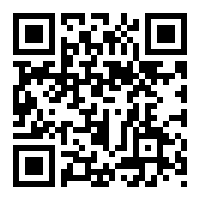

_You can scan this to open the youtube video on your phone, which you can hold to the microphone while developing._

### Microphone pre-amp

The first part we'll talk about is the microphone and pre-amp circuit, below.

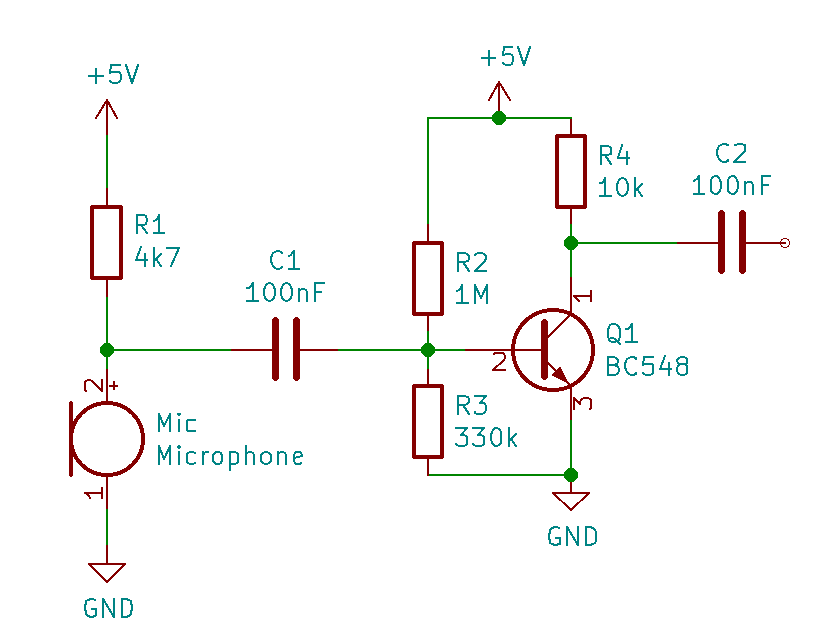

We won't be talking too much about what's going on here; you should be be able to build it and get decent results. The main dot points are:

- The microphone (is polarity sensitive, the case is grounded) is pulled up to 5V with the 4.7k resistor.
- the capacitors in the circuit do nothing other than to separate the DC signals from both sides of the circuit. Capacitors block DC and allow through AC, which is what audio signals are.
- The transistor circuit provides the boost. it's the **amp** in "pre-_amp_" and will take the power of the circuit to be a lot stronger and able to be picked up by the tone decoder IC. For information on _biasing_ the transistor, check out the [Further Reading](#Further-reading) section; but you can just copy what we have here without issues.

### Tone Decoder IC

After the transistor and the capacitor, the signal is fed into our `567 Tone Decoder` IC, which will output (active `low`) the signal that it picks up, tuned to a specific frequency.

The circuit what we are going for is below, you can read the [datasheet](https://jaycar.com.au/p/ZL3567) for the tone decoder IC to find the calculations on selecting the right frequency.

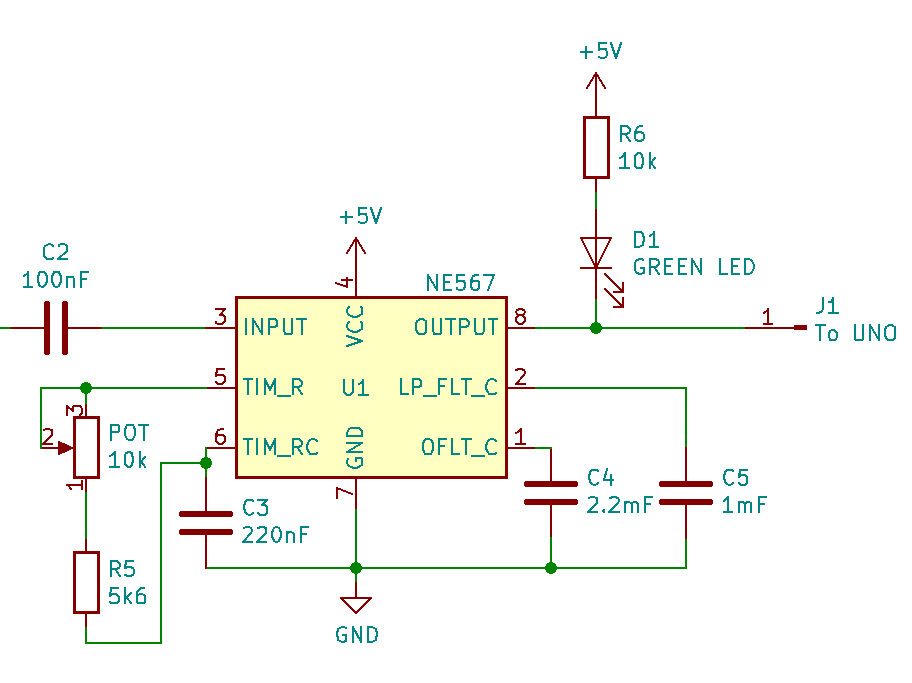

Note the pin numbering on the above diagram, it's a little out of order to make it easier for the schematic view, however on the board, C3 C4 and C5 are next to each other ( You'll see the board soon.) C2 is the same C2 from the preamp circuit.

As mentioned, the active output of the 567 is `LOW`, which will ground the LED which turns the LED on. this also means that the signal is inverted when it goes to the UNO, which is something to keep in mind.

Once the two parts are made, you can easily test them with an oscilloscope such as our [QC1936](https://jaycar.com.au/p/QC1936) and see the nice clean signal as it comes through

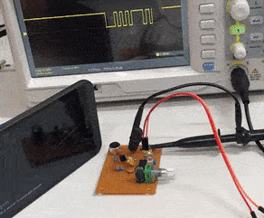

_larger video found in the images folder_

## Building the boards

Next up we'll talk about building the boards themselves. Firstly the tone decoder board:

### Tone decoder PCB board

_Note, in our pcb we used an electrolytic cap, located near the potentiometer; this won't be needed in your project_

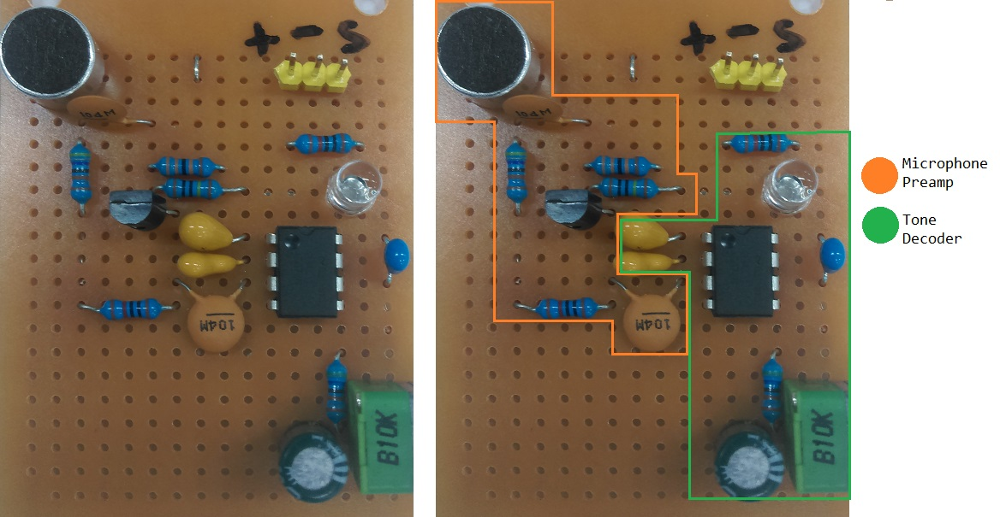

We've highlighted the separation of the two parts, the `microphone pre-amp` and the `tone decoder IC` sections. This makes it a little easier to visualise what's going on and how the two parts fit together. It might be easier to first make the pre-amp circuit first and fit in the tone decoder afterwards. It's also worth while to play around with the circuit on a breadboard so you know how the tone decoder works.

You can see on `pin 3` of the tone decoder IC, the cap (with the label of `104M` = 100nF) is what connects the _collector_ of the transistor to the IC. This is what we have in the schematics above as well.

Below is a picture of the underside of the PCB to show the solder connections; We had to make a few cuts in the board to make sure all the connections work, which you can use a hobby or stanley knife (such as [HG9955](https://jaycar.com.au/p/HG9955) or [TH1916](https://jaycar.com.au/p/TH1916))to make.

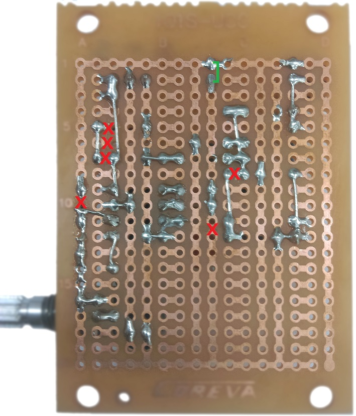

One of the main things to realise is the microphone has a polarity and must be connected the correct way.
In the images folder for the project we do have a larger image if you want a close up on what to solder.

### UNO prototyping shield

The shield will contain the buzzer, button, and OLED screen.

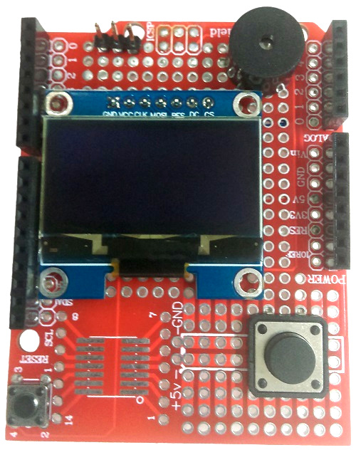

We've placed the button near the bottom so it's a little easier to act as a one-handed device, which you would be able to press the button with your thumb.

The underside of the prototyping shield is as below, along with the pinouts:

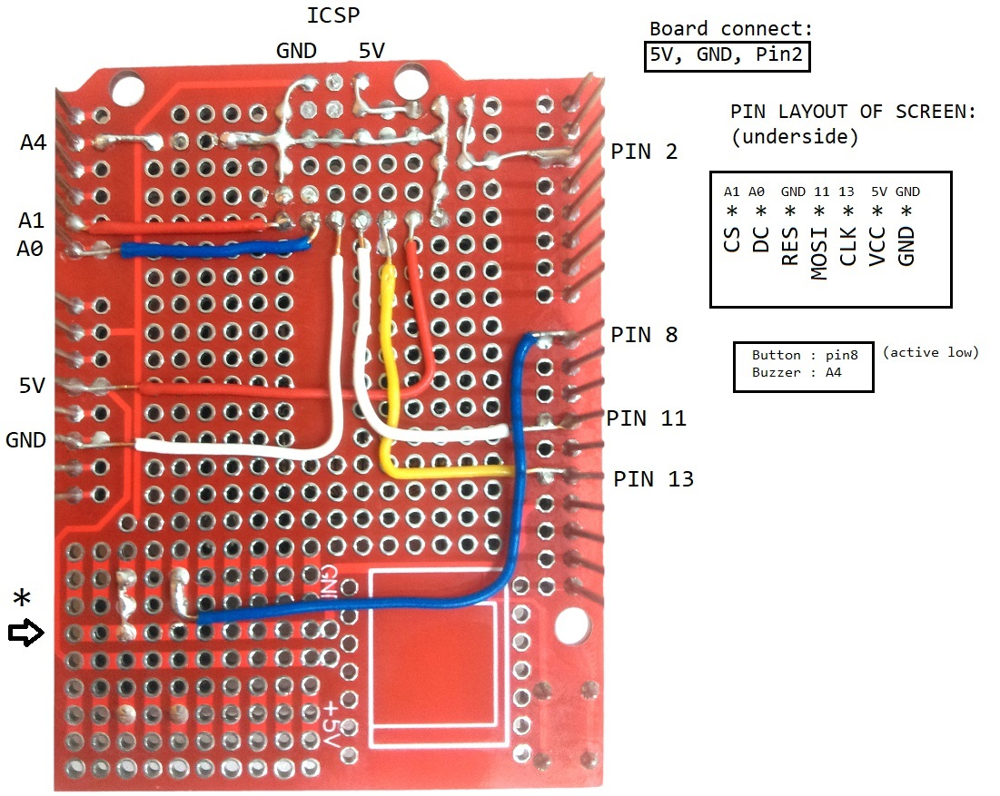

We removed the ICSP header pins and used the `5V` and `GND` connections, as labelled. One easily forgotten connection is that one of the button pins must be connected to ground, then we will set pin 8 as `INPUT_PULLUP`.

Make sure that the buzzer is orientated the correct way as well, with the positive connecting to `A4`.

## Programming source code

The main `.ino` is pretty simple to read, as most of the functions are taken out into their own independent source code files.

We did chance to come across a morse code decoder project on the arduino project hub [here](https://create.arduino.cc/projecthub/shjin/adaptive-led-morse-code-decoder-and-timer-interrupt-8d18a7) which has been modified to work with this project.

The original code included a great `AdaptiveLogicLevel` class which would be great for analogue sensors (such as an [LDR](https://jaycar.com.au/p/XC4446)), however we won't need that for this project, as we are using a digital logic level.

The general premise is:

- A Timer fires off every millisecond which puts information into `MorseCodeElementProcessor`
- Once the `MorseCodeElementProcessor` determines there's enough to decode, it signals to the `MorseCodeProcessor` to output the actual character
- Each `MorseCodeElement` is one dit (`.`) or dah (`-`)

At the moment, we only have Serial mode working, which is a talkback and communication channel between the Serial Monitor and the microphone/buzzer. Try it out!

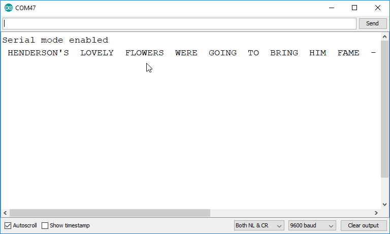

Definitely check out the `Issues` tab on github for how else we can expand this project, as well as clean it up and make it tidier to read. We will be bringing out a github guide soon so if you're not too keen in the github process you can check out some youtube videos, such as [this one](https://www.youtube.com/watch?v=nT8KGYVurIU).

## Use

Hold down the button while resetting the unit, you'll get a serial menu opened to select mode. Serial Mode is '1' which works correctly, we can update this readme once the other sections are filled in.

### Tuning the decoder

Hold a speaker up to the microphone and play morse code; You will have to turn the pot to try to `tune` the tone decoder into the correct tone you're looking for. You will know it's the right tone when you can see the Green LED light up.

### Serial mode

Open the serial monitor, any morse code you find should be decoded and printed out in the Serial channel. You can also send a string to the morse and it will play the tone out of the buzzer.

## Further reading

- Transistor biasing
  - <https://www.electronics-tutorials.ws/amplifier/transistor-biasing.html>
  - <https://en.wikipedia.org/wiki/Bipolar_transistor_biasing>
- Electronic component basics
  - <https://www.youtube.com/watch?v=6Maq5IyHSuc>

### Where to Find Morse Code:

Any short-wave radio receiver with Single Side-band (SSB) function can receive Morse code to use with this project. Our [AR1780](https://jaycar.com.au/p/AR1780) Short-wave Radio with SSB would be perfect!

Every amateur radio band has a section allocated exclusively for Morse code at the lower edge of the band. For example, on the 40m band, you can hear very clear Morse transmissions between 7000 - 7030kHz just after sunset.

On top of this, there are radio beacons in every country that transmit a continuous tone with station identification in Morse code every 30 or 60 seconds.

And of course, youtube.
